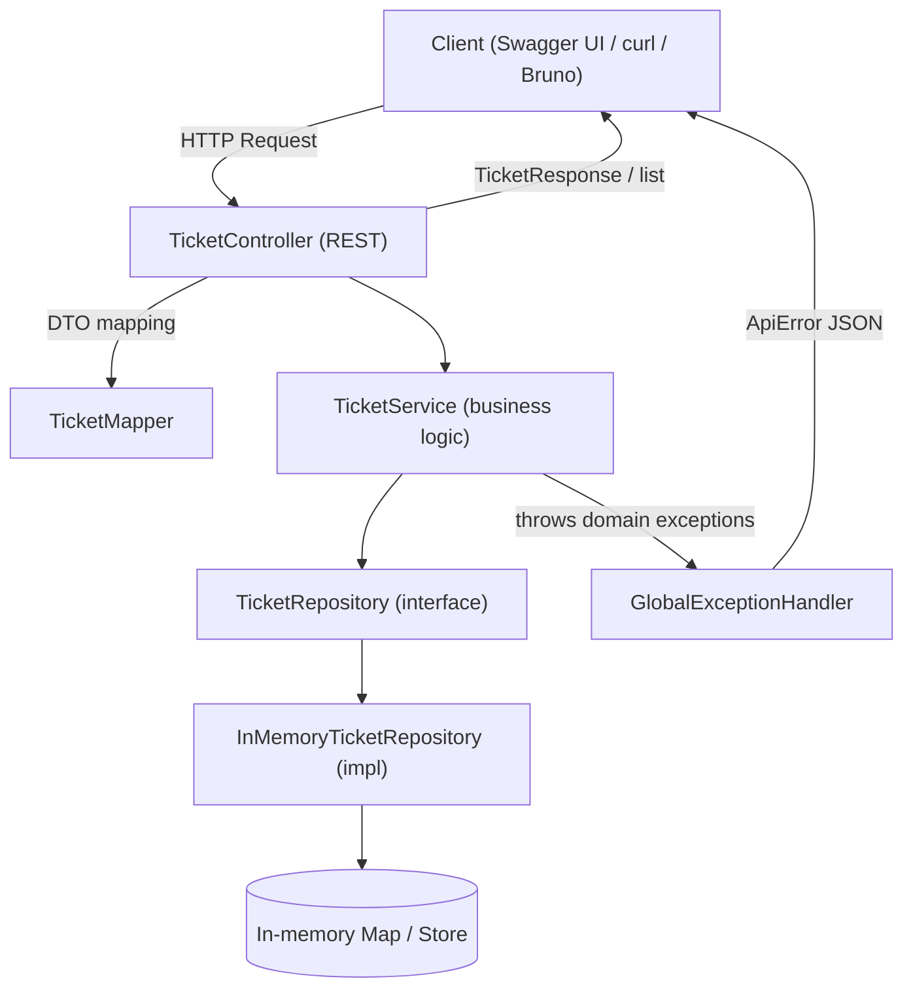

# Helpdesk Ticket Triage System

A staged helpdesk ticketing project focused on backend fundamentals—starting with a console workflow (Stage 1) and evolving into a **Spring Boot REST API with Swagger/OpenAPI** (Stage 2). Stage 3+ expands toward database persistence, auth, and production-grade testing.

---

## Stages at a glance

### Stage 1 — Console App (foundation)
- Console CRUD for tickets
- Ticket workflow via enums (status/priority)
- Basic search
- SQLite persistence (JDBC)

### Stage 2 — Spring Boot REST API (current)
- **REST CRUD API** under `/api/tickets`
- **Swagger UI + OpenAPI** documentation
- DTO-based request/response modeling
- Validation + consistent error responses (centralized exception handling)
- Repository abstraction with an **in-memory repository** (no DB yet)
- Bruno collection (optional) for local API testing

### Stage 3+ (planned)
- Replace in-memory repository with a real database (JPA + H2/Postgres)
- Pagination/filtering/sorting
- Authentication/authorization
- Audit fields (`createdAt`, `updatedAt`)
- Robust integration tests (MockMvc / Testcontainers)

---

## Tech stack

- Java 17+ (project compiles with modern JDKs)
- Spring Boot (Web + Validation)
- Maven
- springdoc-openapi (Swagger UI)
- Bruno (optional API client for testing)

---

## Architecture overview (Stage 2)



**Key idea:** Controller handles HTTP + DTOs, Service owns business logic, Repository abstracts persistence. In Stage 2 the persistence is memory-backed; Stage 3 swaps in a database behind the same interface.

---

## Project structure (Stage 2)

Typical layout:

```
src/main/java/com/johndoan/helpdesk
├── api
│   ├── TicketController.java
│   ├── TicketMapper.java
│   └── dto
│       ├── CreateTicketRequest.java
│       ├── UpdateTicketRequest.java
│       └── TicketResponse.java
├── config
│   ├── CorsConfig.java
│   └── OpenApiConfig.java
├── domain
│   ├── Ticket.java
│   ├── TicketStatus.java
│   └── Priority.java
├── exception
│   ├── ApiError.java
│   ├── BadRequestException.java
│   ├── NotFoundException.java
│   └── GlobalExceptionHandler.java
├── repo
│   ├── TicketRepository.java
│   └── InMemoryTicketRepository.java
└── service
    └── TicketService.java
```

---

## How to run (Stage 2)

### 1) Start the app

Run from the directory that contains `pom.xml`:

```bash
mvn clean package
mvn spring-boot:run
```

You should see logs indicating Tomcat started on port **8080**.

### 2) Open Swagger UI

- Swagger UI: `http://localhost:8080/swagger-ui/index.html`
- OpenAPI JSON: `http://localhost:8080/v3/api-docs`

> Note: `/actuator/health` will return 404 unless Spring Boot Actuator is added/enabled. Stage 2 does not require Actuator.

---

## API endpoints (Stage 2)

Base path: `http://localhost:8080/api/tickets`

- `GET /api/tickets` — list all tickets
- `GET /api/tickets/{id}` — get ticket by id
- `POST /api/tickets` — create ticket
- `PUT /api/tickets/{id}` — replace ticket
- `PATCH /api/tickets/{id}` — partial update
- `DELETE /api/tickets/{id}` — delete ticket

---

## Example requests (curl)

### Create ticket (POST)
```bash
curl -i -X POST "http://localhost:8080/api/tickets" \
  -H "Content-Type: application/json" \
  -d '{
    "title": "Laptop won''t boot",
    "description": "Stuck at black screen",
    "priority": "MEDIUM"
  }'
```

### List tickets (GET)
```bash
curl -s "http://localhost:8080/api/tickets"
```

### Replace ticket (PUT)
```bash
curl -i -X PUT "http://localhost:8080/api/tickets/1" \
  -H "Content-Type: application/json" \
  -d '{
    "title": "Laptop won''t boot (updated)",
    "description": "Now also shows error code 3-7",
    "priority": "MEDIUM",
    "status": "IN_PROGRESS"
  }'
```

### Partial update (PATCH)
```bash
curl -i -X PATCH "http://localhost:8080/api/tickets/1" \
  -H "Content-Type: application/json" \
  -d '{
    "status": "RESOLVED"
  }'
```

### Not found demo (GET → 404)
```bash
curl -i "http://localhost:8080/api/tickets/9999"
```

---

## Bruno local API testing (optional)

Bruno is a lightweight API client that stores requests in files (great for portfolios and Git).

### Setup
1. Create a collection: `helpdesk-triage-stage2`
2. Create an environment named **local**
3. Add variable:
    - `baseUrl = http://localhost:8080`
4. Create requests using `{{baseUrl}}/api/tickets`

Suggested requests:
- GET All Tickets
- POST Create Ticket
- GET Ticket by ID
- PUT Replace Ticket
- PATCH Partial Update
- DELETE Ticket
- GET Missing Ticket (id = 9999)

---

## Portfolio screenshots (Stage 2)

Recommended screenshots to capture:
1. **Terminal** — `mvn spring-boot:run` successful startup log
2. **Swagger UI** — endpoints list visible
3. **POST Create** — request + 201 response visible (Swagger or Bruno)
4. **GET All** — list shows the created ticket
5. **PUT or PATCH** — updated fields visible in response
6. **404 Not Found** — `GET /api/tickets/9999` returns ApiError JSON
7. **Bruno** (optional) — successful POST or GET with environment variable `baseUrl`

---

## Notes / limitations (Stage 2)

- Storage is **in-memory**; restarting the app clears tickets.
- Designed to keep layers clean so Stage 3 can replace persistence without rewriting controllers.

---

## License
Educational / portfolio project.
