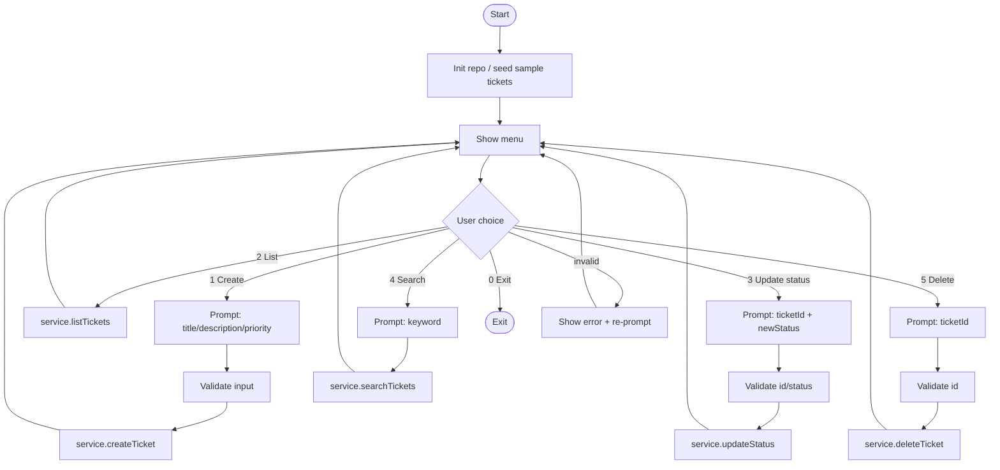

# Helpdesk Ticket Triage System — Stage 1 (Console + In‑Memory)

Stage 1 is a **console-driven ticket workflow** with an **in-memory repository**.  
You can create, list, update status, search, and delete tickets. This stage is intentionally small and testable; persistence (SQLite) and richer UI come later.

---

## Features (Stage 1)

- Create a ticket (title/description/priority)
- List tickets
- Update ticket status (e.g., OPEN → IN_PROGRESS → RESOLVED)
- Search tickets (keyword)
- Delete tickets
- Seed sample tickets for quick demo

---

## Tech Stack

- Java 21
- Maven
- Console UI (no Swing/JavaFX yet)
- In-memory repository (Stage 2 adds SQLite via JDBC)

---

## Project Layout (recommended)

```
helpdesk-triage (Stage 1)/
  pom.xml
  README.md
  src/
    main/
      java/
        com/johndoan/helpdesk/
          Main.java
          domain/
            Ticket.java
            Priority.java
            Status.java
          repository/
            TicketRepository.java
            InMemoryTicketRepository.java
          service/
            TicketService.java
          ui/
            ConsoleMenu.java
```

> Note: Having a `ui/` package in Stage 1 is fine — it is still “UI”, just **console UI**.

---

## How to Run

### Option A — Run from IntelliJ
1. Open the project folder.
2. Open `Main.java`.
3. Click **Run**.

### Option B — Run with Maven
From the Stage 1 project root:

```bash
mvn -q clean package
```

Then run your `Main` class (update the package path to match your code):

```bash
java -cp target/classes com.johndoan.helpdesk.Main
```

---

## Console Workflow (Mermaid)

> If you don’t see the diagram rendered:
> - GitHub renders Mermaid in Markdown, but some local Markdown previewers do **not**.
> - On GitHub, ensure this is a `.md` file and the code fence is exactly ```mermaid (no indentation).



---

## Architecture (Mermaid)
```mermaid
flowchart LR
    UI["Console UI<br/>(menu + input)"] --> S["Service Layer<br/>(rules + validation)"]
    S --> R["Repository<br/>(In-memory for Stage 1)"]
    R --> D["Domain Model<br/>(Ticket + enums)"]

    subgraph "Stage 2+"
        R2["SQLite Repository<br/>(JDBC)"]:::planned
    end

    classDef planned fill:#fff3cd,stroke:#b38b00,color:#000;


