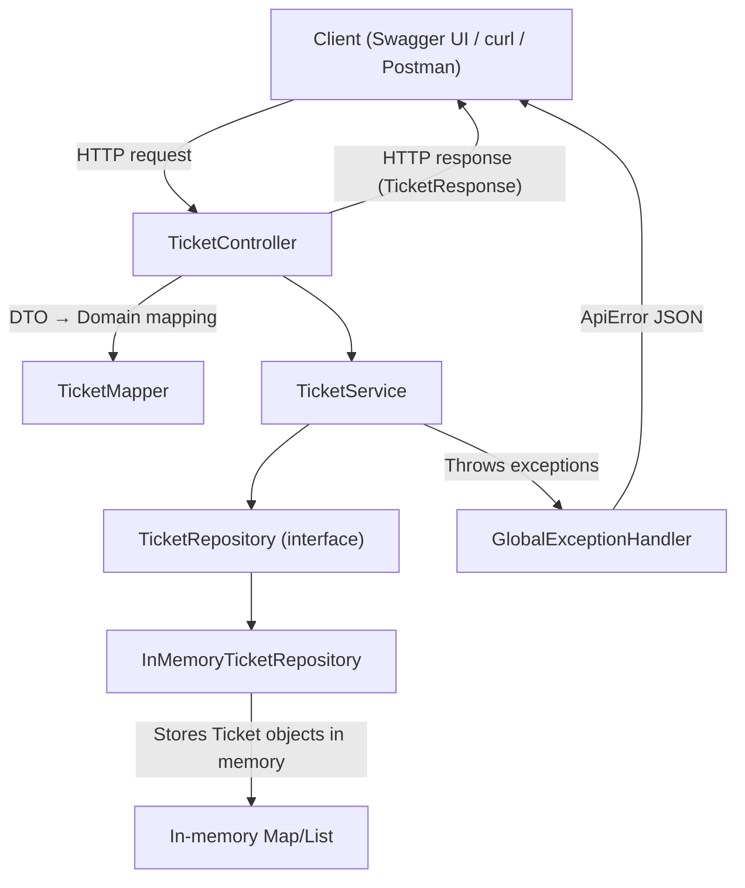

# Helpdesk Ticket Triage System — Stage 2 (Spring Boot + Swagger CRUD)

Stage 2 delivers a working **REST API** for helpdesk tickets using **Spring Boot** with:
- A clean layered architecture (**Controller → Service → Repository → Domain**)
- **CRUD endpoints** exposed via HTTP
- **Swagger UI / OpenAPI** documentation for interactive testing
- An **in-memory repository** (data resets on restart)

---

## What Stage 2 Is For

Stage 2 is focused on building the backend API so you can:
- Create tickets
- View one ticket or all tickets
- Update tickets (full replace or partial update)
- Delete tickets  
  …and test everything easily via **Swagger UI** or **curl**.

> ✅ Swagger UI and CLI (curl) both hit the same running API, so they stay in sync **during the same server run**.

---

## Tech Stack

- Java (recommended: 21+)
- Maven
- Spring Boot
- springdoc-openapi (Swagger UI)

---

## Project Structure

```
src/main/java/com/johndoan/helpdesk
├── HelpdeskTriageApplication.java
├── api
│   ├── TicketController.java
│   ├── TicketMapper.java
│   └── dto
│       ├── CreateTicketRequest.java
│       ├── UpdateTicketRequest.java
│       └── TicketResponse.java
├── config
│   ├── CorsConfig.java
│   └── OpenApiConfig.java
├── domain
│   ├── Priority.java
│   ├── Ticket.java
│   └── TicketStatus.java
├── exception
│   ├── ApiError.java
│   ├── BadRequestException.java
│   ├── GlobalExceptionHandler.java
│   └── NotFoundException.java
├── repo
│   ├── TicketRepository.java
│   └── InMemoryTicketRepository.java
└── service
    └── TicketService.java
```

---

## Runtime Behavior (Important)

Stage 2 uses an **in-memory repository**:
- Tickets exist only **while the server is running**
- Restarting the app clears the data

---

## Flowchart (Mermaid)


---

## How to Run

### 1) Build
```bash
mvn clean package
```

### 2) Run the app
```bash
mvn spring-boot:run
```

### 3) Open Swagger UI
```bash
open http://localhost:8080/swagger-ui/index.html
```

### 4) Confirm API docs JSON
```bash
curl -i http://localhost:8080/v3/api-docs
```

---

## Endpoints (CRUD)

Base path: `http://localhost:8080/api/tickets`

| Method | Endpoint | Description |
|-------:|----------|-------------|
| GET | `/api/tickets` | List all tickets |
| GET | `/api/tickets/{id}` | Get ticket by id |
| POST | `/api/tickets` | Create a ticket |
| PUT | `/api/tickets/{id}` | Replace a ticket |
| PATCH | `/api/tickets/{id}` | Partially update a ticket |
| DELETE | `/api/tickets/{id}` | Delete a ticket |

---

## Testing With curl

### Create a ticket
```bash
curl -i -X POST http://localhost:8080/api/tickets   -H "Content-Type: application/json"   -d '{
    "title": "Printer not working",
    "description": "Printer shows error code E13.",
    "priority": "HIGH"
  }'
```

### List all tickets
```bash
curl -i http://localhost:8080/api/tickets
```

### Get a ticket by id
```bash
curl -i http://localhost:8080/api/tickets/1
```

### Replace a ticket (PUT)
```bash
curl -i -X PUT http://localhost:8080/api/tickets/1   -H "Content-Type: application/json"   -d '{
    "title": "Printer not working - updated",
    "description": "Still failing after reboot.",
    "priority": "MEDIUM",
    "status": "IN_PROGRESS"
  }'
```

### Partial update (PATCH)
```bash
curl -i -X PATCH http://localhost:8080/api/tickets/1   -H "Content-Type: application/json"   -d '{
    "status": "RESOLVED"
  }'
```

### Delete
```bash
curl -i -X DELETE http://localhost:8080/api/tickets/1
```

---

## Common Issues & Fixes

### Swagger UI shows no operations
Usually caused by:
- Controller not detected (wrong package scan)
- Missing `@RestController` or `@RequestMapping`
- OpenAPI config mismatch

Fix:
- Confirm the app main class is in `com.johndoan.helpdesk` so it scans subpackages.
- Confirm Swagger JSON loads:
  ```bash
  curl -i http://localhost:8080/v3/api-docs
  ```

### `curl /actuator/health` returns 404
That means Actuator is not enabled/exposed (Stage 2 may not require it).  
If you want it:
- Add `spring-boot-starter-actuator` dependency
- Expose endpoints in `application.yml`

---

## Stage 2 Completion Checklist

- [ ] App builds with `mvn clean package`
- [ ] App runs with `mvn spring-boot:run`
- [ ] Swagger UI shows CRUD endpoints
- [ ] POST → GET returns created ticket
- [ ] PUT/PATCH updates ticket
- [ ] DELETE removes ticket
- [ ] Errors return JSON via GlobalExceptionHandler

---
