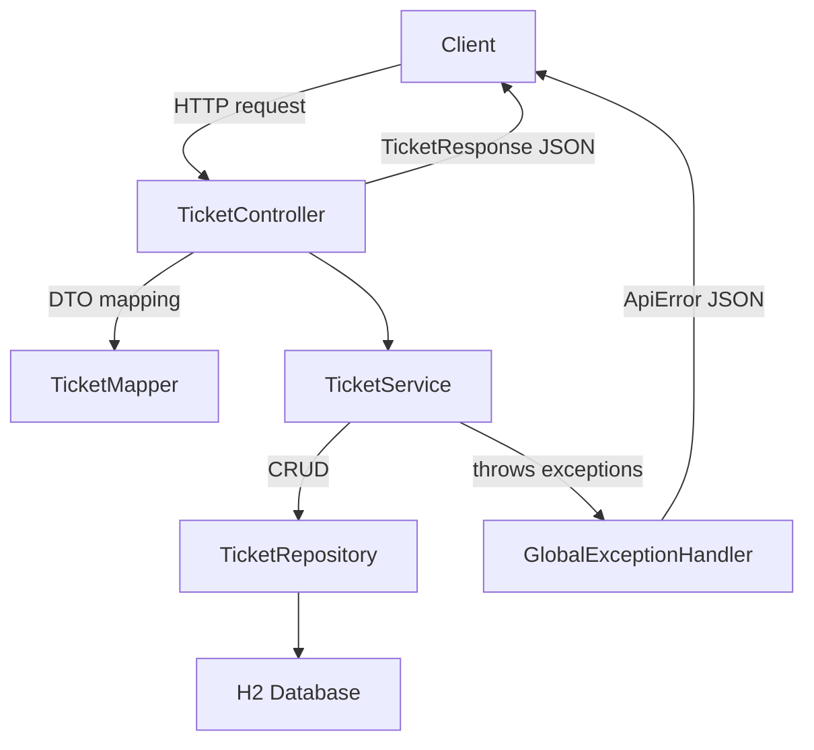

# Helpdesk Ticket Triage System — Stage 3 (Persistence w/ JPA + H2)

Stage 3 upgrades Stage 2’s in-memory storage to a **real persistence layer** using **Spring Data JPA** and an **H2 database**.  
You still interact with the system through the same **REST API**, documented in **Swagger UI**.

---

## What Stage 3 is for

**Goal:** keep Stage 2’s API + validation + error handling, but replace the repository implementation so tickets persist across requests (and can be inspected via a DB console).

You should be able to:
- Run the Spring Boot app
- Create/read/update/delete tickets via Swagger UI / Bruno / curl
- Confirm the data is stored in **H2** (H2 Console) rather than a Java list/map
- Keep consistent API responses and error JSON

---

## Tech Stack

- Java 17+ (project may compile with newer JDKs, but target is 17+)
- Spring Boot
- Spring Web (REST)
- Spring Data JPA (persistence)
- H2 Database (local dev DB)
- springdoc-openapi + Swagger UI
- Bean Validation (Jakarta Validation)
- Centralized exception handling (`GlobalExceptionHandler` → `ApiError`)
- (Optional) Spring Boot Actuator (`/actuator/health`)

---

## Architecture (request flow)



---

## Project Layout (high-level)

Typical Stage 3 structure:

```
src/main/java/com/johndoan/helpdesk
  HelpdeskTriageApplication.java
  api/
    TicketController.java
    TicketMapper.java
    dto/
      CreateTicketRequest.java
      UpdateTicketRequest.java
      TicketResponse.java
  config/
    OpenApiConfig.java
    CorsConfig.java
  domain/
    Ticket.java
    TicketStatus.java
    Priority.java
  exception/
    ApiError.java
    BadRequestException.java
    NotFoundException.java
    GlobalExceptionHandler.java
  repo/
    TicketRepository.java   <-- Spring Data JPA repository (interface)
  service/
    TicketService.java
src/main/resources
  application.yml
```

> **Stage 3 key change:** `TicketRepository` should be a Spring Data JPA repository (e.g., extends `JpaRepository<Ticket, Long>`), and the old `InMemoryTicketRepository` is no longer used.

---

## Configuration (H2)

The `application.yml` should include an H2 datasource and JPA settings.  
Exact values may differ, but the idea is:

- `spring.datasource.url=jdbc:h2:mem:...` (in-memory) **or** `jdbc:h2:file:...` (file-based)
- enable the H2 console if you want to visually confirm saved rows
- set Hibernate DDL mode to create/update during development

Example URLs:
- **Swagger UI:** `http://localhost:8080/swagger-ui/index.html`
- **H2 Console (optional):** `http://localhost:8080/h2-console`

---

## How to run (Stage 3)

### 1) Go to the folder that contains `pom.xml`

```bash
cd "/path/to/helpdesk-triage (Stage 3)/Helpdesk Ticket Triage System"
ls
```

✅ You must see `pom.xml`.

### 2) Clean + build

```bash
mvn clean package
```

### 3) Run

```bash
mvn spring-boot:run
```

You should see logs like:
- “Tomcat started on port 8080”
- “Started HelpdeskTriageApplication …”

---

## Verify locally

### Swagger UI (OpenAPI)
Open in browser:

- `http://localhost:8080/swagger-ui/index.html`

### Health check (only if Actuator is enabled)
```bash
curl -i http://localhost:8080/actuator/health
```

### H2 Console (only if enabled)
- `http://localhost:8080/h2-console`

Use the same JDBC URL as in `application.yml`.

---

## API Endpoints (Stage 3)

Base path:

- `/api/tickets`

Common endpoints:

- `GET    /api/tickets` — list tickets
- `GET    /api/tickets/{id}` — get by id
- `POST   /api/tickets` — create ticket
- `PUT    /api/tickets/{id}` — update ticket
- `DELETE /api/tickets/{id}` — delete ticket

> Your exact methods (PUT vs PATCH) depend on how you implemented update in Stage 2/3.

---

## Example curl commands

### Create a ticket
```bash
curl -i -X POST "http://localhost:8080/api/tickets" \
  -H "Content-Type: application/json" \
  -d '{
    "title": "VPN not connecting",
    "description": "User cannot connect to VPN after password reset",
    "priority": "HIGH"
  }'
```

### Get all tickets
```bash
curl -i "http://localhost:8080/api/tickets"
```

### Get ticket by id (example: 1)
```bash
curl -i "http://localhost:8080/api/tickets/1"
```

### Update ticket (example: id=1)
```bash
curl -i -X PUT "http://localhost:8080/api/tickets/1" \
  -H "Content-Type: application/json" \
  -d '{
    "title": "VPN not connecting (updated)",
    "description": "Investigating client config",
    "priority": "MEDIUM",
    "status": "IN_PROGRESS"
  }'
```

### Trigger a 404 (portfolio-friendly)
```bash
curl -i "http://localhost:8080/api/tickets/9999"
```

Expected:
- HTTP 404
- `ApiError` JSON (timestamp/status/message/path)

---

## Common Build Errors (and fixes)

### “There is no POM in this directory”
You ran Maven from the wrong folder.  
Fix: `cd` into the directory that contains `pom.xml`.

### “duplicate class: TicketStatus” or “bad source file … TicketStatus.java”
This usually means **two copies** of `TicketStatus.java`, or a wrong `package` line.

Fix:
1. Find duplicates:
   ```bash
   find . -name "TicketStatus.java" -print
   ```
2. Keep only:
   ```
   src/main/java/com/johndoan/helpdesk/domain/TicketStatus.java
   ```
3. Ensure the file begins with:
   ```java
   package com.johndoan.helpdesk.domain;
   ```

### “cannot find symbol TicketStatus.OPEN / NEW”
Your code references a status enum constant that doesn’t exist.

Fix: Ensure `TicketStatus` contains only the values your service/domain uses (example):
- `NEW, IN_PROGRESS, WAITING_ON_CUSTOMER, RESOLVED, CLOSED`

---

## Portfolio Screenshots (suggested)

1. Terminal: `mvn spring-boot:run` showing successful startup
2. Swagger UI: endpoints list
3. POST create ticket: request + response visible
4. GET all tickets: shows newly created ticket
5. PUT/UPDATE: response visible
6. 404 error: GET `/api/tickets/9999` returns `ApiError` JSON
7. H2 console showing saved ticket rows (Stage 3 highlight)

---

## Next Stage Ideas (Stage 4+)

- Postgres (real DB) + Flyway/Liquibase migrations
- Pagination / filtering / sorting
- Authentication / authorization (Spring Security)
- Audit fields: createdAt / updatedAt
- Integration tests: MockMvc / Testcontainers
- Containerize: Docker + docker-compose

---

## License
For portfolio / learning use.
