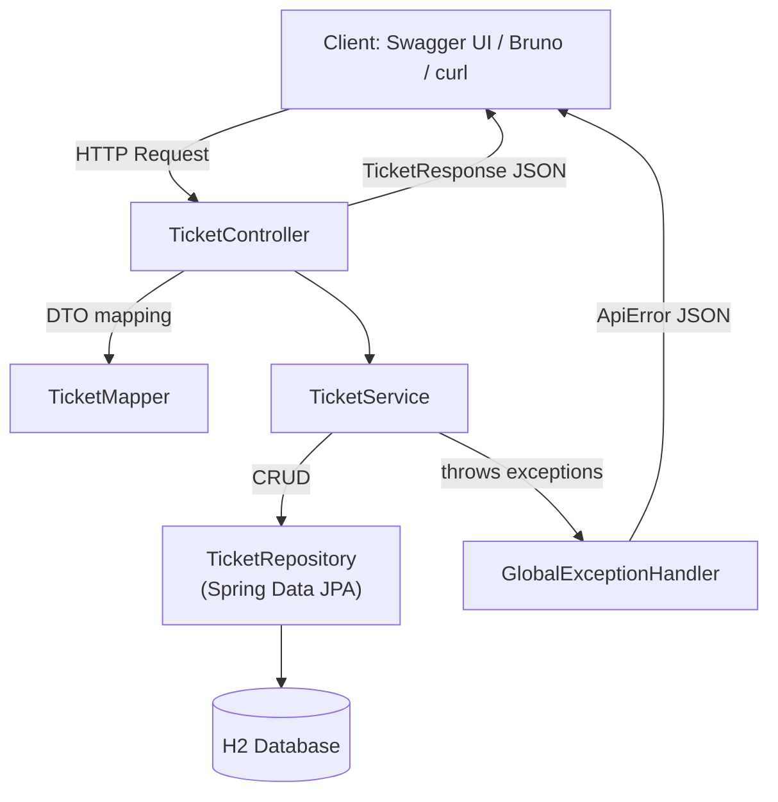

# Helpdesk Ticket Triage System — Stage 3 (Spring Data JPA + H2)

Stage 3 upgrades the Stage 2 REST API by replacing the in-memory repository with **real persistence** using **Spring Data JPA** and an **H2 in-memory database**. You still use **Swagger UI** and **Bruno** to exercise CRUD, but now you can also verify data directly in the **H2 Console**, and check runtime health via **Spring Boot Actuator**.

---

## What Stage 3 demonstrates

- **CRUD REST API** for tickets under `/api/tickets`
- **Persistence layer** via **Spring Data JPA** (tickets are stored in H2, not in memory)
- **OpenAPI/Swagger UI** documentation
- **Bean Validation** on request DTOs (reject invalid payloads)
- **Centralized error handling** returning consistent `ApiError` JSON
- **Operational endpoint**: `/actuator/health` (Actuator)

---

## Tech stack

- Java 17+ (project may compile with higher local JDKs)
- Spring Boot
- Spring Web (Spring MVC)
- Spring Data JPA (Hibernate)
- H2 Database (in-memory)
- springdoc-openapi (Swagger UI)
- Spring Boot Actuator
- Maven

---

## Architecture



**Key difference vs Stage 2:** Stage 2 uses an `InMemoryTicketRepository`. Stage 3 uses **Spring Data JPA** with **H2**, so records persist for the lifetime of the running app and are queryable in the H2 Console.

---

## Local setup

### Prerequisites
- Java 17+
- Maven 3.9+

### Run the app
From the directory that contains `pom.xml`:

```bash
mvn clean package
mvn spring-boot:run
```

You should see the app start on **port 8080**.

---

## Useful URLs

- **Swagger UI:** `http://localhost:8080/swagger-ui/index.html`
- **OpenAPI JSON:** `http://localhost:8080/v3/api-docs`
- **Actuator Health:** `http://localhost:8080/actuator/health`
- **H2 Console:** `http://localhost:8080/h2-console`

---

## H2 Console (verify rows in the database)

1. Start the app (`mvn spring-boot:run`)
2. Open: `http://localhost:8080/h2-console`
3. Use:
   - **Driver Class:** `org.h2.Driver`
   - **JDBC URL:** `jdbc:h2:mem:helpdesk;DB_CLOSE_DELAY=-1;MODE=PostgreSQL`
      - (or `jdbc:h2:mem:helpdesk` if your config is simpler)
   - **User Name:** `sa`
   - **Password:** *(blank)*
4. Click **Connect**
5. Run a query (table name may be `ticket` or `tickets` depending on your entity naming):
   ```sql
   SELECT * FROM ticket;
   ```
   If that fails, try:
   ```sql
   SHOW TABLES;
   SELECT * FROM tickets;
   ```

> Tip: Create a ticket first via Swagger/Bruno, then refresh H2 Console and query again to confirm the row exists.

---

## API endpoints (Stage 3)

Base path: `/api/tickets`

Common operations:
- `GET /api/tickets` — list all tickets
- `GET /api/tickets/{id}` — get one ticket
- `POST /api/tickets` — create a ticket
- `PUT /api/tickets/{id}` or `PATCH /api/tickets/{id}` — update a ticket
- `DELETE /api/tickets/{id}` — delete a ticket

> Exact request/response shapes are shown in Swagger UI.

---

## Example curl commands

### Create a ticket
```bash
curl -i -X POST "http://localhost:8080/api/tickets"   -H "Content-Type: application/json"   -d '{"title":"VPN not working","description":"Cannot connect to VPN","priority":"HIGH"}'
```

### List tickets
```bash
curl -i "http://localhost:8080/api/tickets"
```

### Update a ticket (example)
```bash
curl -i -X PATCH "http://localhost:8080/api/tickets/1"   -H "Content-Type: application/json"   -d '{"status":"IN_PROGRESS"}'
```

### Trigger a 404 (for portfolio screenshot)
```bash
curl -i "http://localhost:8080/api/tickets/9999"
```

---

## Health status (Actuator)

```bash
curl -i "http://localhost:8080/actuator/health"
```

Expected output includes `"status":"UP"` when the app is running.

---

## Bruno (local API testing)

Recommended setup:
- Create a collection: `helpdesk-triage-stage3`
- Environment: `local`
- Variable: `baseUrl = http://localhost:8080`

Then create requests:
- `GET {{baseUrl}}/api/tickets`
- `POST {{baseUrl}}/api/tickets`
- `PATCH {{baseUrl}}/api/tickets/{{id}}`
- `GET {{baseUrl}}/actuator/health`

---

## Stage 2 vs Stage 3 (quick comparison)

- **Stage 2:** In-memory repository (data resets and is not queryable via DB tools)
- **Stage 3:** JPA + H2 persistence (data stored in H2 while the app runs; verifiable via H2 Console)

---

